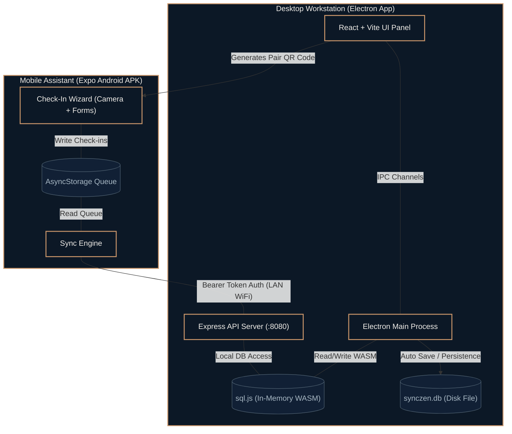
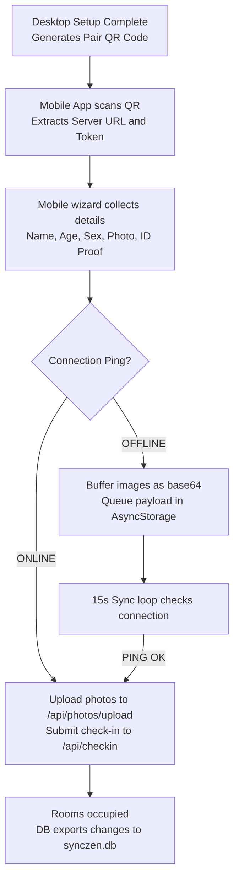

<p align="center">
  
</p>
<h1 align="center">SyncZen Local: Your Local Hotel Check-In System</h1>
<p align="center">
  <strong>⚡ Modern, unified hotel check-in and data tracking ecosystem running entirely on your local network</strong><br/>
  <em>Pair device ➔ capture guest details and ID proof ➔ sync instantly or buffer offline — all secure 🛡️</em>
</p>

<p align="center">
  
  
  
  
  
</p>

---

## Table of Contents

- 🔍 [Overview](#overview)
- 🎯 [Why SyncZen Local?](#why-synczen-local)
- ✨ [Features](#features)
- 💾 [Database Schema and Storage](#database-schema-and-storage)
- 🏗️ [Architecture](#architecture)
- 🔄 [Pipeline Flow and Processing Overview](#pipeline-flow-and-processing-overview)
- 🎨 [Visual UI Guides](#visual-ui-guides)
- 🔌 [API Reference](#api-reference)
- 🚀 [Build Run and Deployment Options](#build-run-and-deployment-options)
- 📁 [Project Structure and Key Components](#project-structure-and-key-components)
- ⚠️ [Troubleshooting and Failsafes](#troubleshooting-and-failsafes)
- 👤 [Author](#author)

---

## Overview

**SyncZen Local** is a secure, local-first guest registration and data management system for hospitality teams. It provides a central administrative dashboard (developed as an Electron desktop workstation) and companion mobile check-in assistant devices (React Native/Expo). 

By hosting its own API server and leveraging in-memory WebAssembly SQLite, SyncZen Local operates entirely within a hotel's local WiFi network. No cloud accounts, databases, or active internet connections are required.

---

## Why SyncZen Local

> **Traditional Property Management Systems (PMS) depend on cloud databases and internet uptime. SyncZen Local keeps your front desk moving, even when the internet goes down. 🌐**

| Operational Metric | Cloud PMS | SyncZen Local |
|---|---|---|
| **📶 WiFi Dependency** | Requires active internet connection to function | Works offline over your local router |
| **⚡ Check-In Speed** | Latency dependent on server responses | Instant local database reads & writes |
| **📷 Media Handling** | Photos uploaded to cloud storage buckets | Compressed photos stored locally on desktop disk |
| **🛡️ Privacy Compliance** | Guest IDs and data shared with third parties | All data and files remain on your premises |
| **🔋 Reliability** | Internet outage = front-desk halt | Zero downtime; mobile syncs queue when off-range |

---

## Features

### 🖥️ Desktop Workstation
*   **Central Administration:** Real-time stats, rooms manager, and guest booking logs.
*   **Embedded WASM DB:** Pure WebAssembly SQLite (`sql.js`), eliminating native binary compilation.
*   **Automatic Backup:** In-memory SQLite database exports and writes to a physical file on every update.
*   **Auto-Checkout:** Automatically checks out overdue guests and frees rooms on boot.
*   **Integrated LAN API:** Built-in Express server that monitors, binds, and authorizes pairing requests.

### 📱 Mobile Assistant
*   **Pairing QR:** Mobile devices scan a desktop QR code to automatically establish a local connection.
*   **Multi-Step Wizard:** Step-by-step forms to capture party size, guest details, and ID proof images.
*   **Offline-First:** Submits check-ins instantly if online; stores them in AsyncStorage if offline.
*   **Camera Integration:** Launches native device camera to capture profile and document photos.

### 🔄 Sync Engine
*   **Base64 Buffering:** Serializes captured images to base64 strings so they survive application restarts.
*   **Auto-Retry:** A 15-second background timer checks connectivity and flushes queued check-ins.
*   **Dynamic Payload Update:** Uploads media files first, receives disk paths, updates references, and submits the booking.

---

## Database Schema and Storage

### Schema SQL DDL

The database structure is managed in `desktop/src/main/db.ts` and contains the following tables:

```sql
-- Represents rooms within the hotel facility
CREATE TABLE IF NOT EXISTS rooms (
  id INTEGER PRIMARY KEY AUTOINCREMENT,
  room_number TEXT NOT NULL UNIQUE,
  room_type TEXT NOT NULL DEFAULT 'Standard',
  floor INTEGER NOT NULL DEFAULT 1,
  status TEXT NOT NULL DEFAULT 'available'
    CHECK(status IN ('available','occupied','maintenance','checkout')),
  price_per_night REAL NOT NULL DEFAULT 0,
  notes TEXT,
  created_at TEXT NOT NULL DEFAULT (datetime('now')),
  updated_at TEXT NOT NULL DEFAULT (datetime('now'))
);

-- Represents guest stay groups/bookings
CREATE TABLE IF NOT EXISTS booking_groups (
  id INTEGER PRIMARY KEY AUTOINCREMENT,
  booking_reference TEXT NOT NULL UNIQUE,
  check_in_time TEXT NOT NULL DEFAULT (datetime('now')),
  check_out_date TEXT NOT NULL,
  status TEXT NOT NULL DEFAULT 'checked_in'
    CHECK(status IN ('checked_in','checked_out','cancelled')),
  notes TEXT,
  id_proof_path TEXT, -- Stores file path of the group ID proof image
  created_at TEXT NOT NULL DEFAULT (datetime('now'))
);

-- Represents individual guests within a booking group
CREATE TABLE IF NOT EXISTS guests (
  id INTEGER PRIMARY KEY AUTOINCREMENT,
  group_id INTEGER NOT NULL REFERENCES booking_groups(id) ON DELETE CASCADE,
  name TEXT NOT NULL,
  phone TEXT,
  age INTEGER,
  sex TEXT CHECK(sex IN ('male','female','other')),
  photo_path TEXT, -- Stores file path of guest profile image on desktop disk
  is_primary_contact INTEGER NOT NULL DEFAULT 0
);

-- Many-to-many relationship mapping booking groups to room allocations
CREATE TABLE IF NOT EXISTS room_allocations (
  id INTEGER PRIMARY KEY AUTOINCREMENT,
  group_id INTEGER NOT NULL REFERENCES booking_groups(id) ON DELETE CASCADE,
  room_id INTEGER NOT NULL REFERENCES rooms(id),
  allocated_at TEXT NOT NULL DEFAULT (datetime('now')),
  UNIQUE(room_id, group_id)
);
```

### Windows File Storage Paths

All persistent configs and files are saved under the Electron application's `userData` folder:

```text
%APPDATA%\SyncZen Local\
```
*(Equivalent to `C:\Users\<username>\AppData\Roaming\SyncZen Local\`)*

*   **SQLite Database File:** `%APPDATA%\SyncZen Local\synczen.db`
*   **Application Config:** `%APPDATA%\SyncZen Local\config.json`
*   **Guest Photos & ID Documents:** `%APPDATA%\SyncZen Local\photos\`
*   **System Log:** `%APPDATA%\SyncZen Local\app.log`

---

## Architecture



<details>
<summary>ASCII fallback (click to expand)</summary>

```
┌──────────────────────────────────────────────────────────┐
│             SyncZen Local Workstation (Desktop)          │
│                                                          │
│  ┌──────────────┐             ┌──────────────────────┐   │
│  │  React UI    │  ◄────────► │ Electron Main        │   │
│  │  Vite Panel  │     IPC     │ process (index.ts)   │   │
│  └──────────────┘             └──────────┬───────────┘   │
│                                          │               │
│  ┌──────────────┐             ┌──────────▼───────────┐   │
│  │  Express API │  ◄────────► │ sql.js WASM          │   │
│  │  Server      │  local query│ (In-Memory database) │   │
│  └──────▲───────┘             └──────────┬───────────┘   │
│         │                                │ export        │
│         │                                ▼               │
│         │                     ┌──────────────────────┐   │
│         │                     │ synczen.db (Disk)    │   │
│         │                     └──────────────────────┘   │
└─────────┼────────────────────────────────────────────────┘
          │ LAN Bearer Token (WiFi)
┌─────────▼────────────────────────────────────────────────┐
│             SyncZen Local Assistant (Mobile App)         │
│                                                          │
│  ┌───────────────────────┐    ┌──────────────────────┐   │
│  │  Check-In Wizard      │    │  Sync Engine         │   │
│  │  Forms + Camera Scan  │    │  AsyncStorage        │   │
│  └──────────┬────────────┘    └──────────▲───────────┘   │
│             │                            │               │
│             └────────────────────────────┘               │
│                       writes queue                       │
└──────────────────────────────────────────────────────────┘
```

</details>

---

## Pipeline Flow and Processing Overview



<details>
<summary>ASCII fallback (click to expand)</summary>

```
Hold Setup / Open App (Desktop) → Starts SQLite, Express Server & opens Firewall
     │
     ▼
Generate pairing QR (Server URL & token)
     │
     ▼
Mobile scan QR (saves to secure settings)
     │
     ▼
Start Wizard Check-In:
  • Party size selection (1–12 or custom)
  • Guest details form (Name, mobile, age, sex)
  • Guest profile photo (Camera capture)
  • Group ID proof (Camera or browse)
  • Room selection & Stay duration
     │
     ├───────────────── Ping Server ─────────────────┐
     │                                               │
     ▼ (If Online)                                   ▼ (If Offline)
Upload photos to /api/photos/upload             Serialize images to base64
     │                                               │
Receive server file paths                            Store check-in in AsyncStorage
     │                                               │
Submit check-in to /api/checkin                 Background timer (every 15s) retries sync
     │                                               │
     ├───────────────── Successful ◄─────────────────┘
     ▼
Allocate rooms in SQLite, occupancies updated
WASM memory database exported to synczen.db
```

</details>

### General Processing Overview

1.  **Workstation Initialization:** When launched, the desktop app boots, reads `synczen.db` into memory, starts the LAN API server on port 8080, and renders the Dashboard interface.
2.  **Device Coupling:** The staff member opens the mobile app and scans the pairing QR code from the desktop "Pair" screen, saving the connection parameters to local secure storage.
3.  **Registration Flow:** Staff uses the mobile wizard to record guests, photograph their profiles and ID cards, and select standard or deluxe rooms.
4.  **Submission Routing:** If connected, the app uploads the photos and sends the booking details. If disconnected, it buffers the images as base64 strings and queue the registration in AsyncStorage, retrying every 15 seconds until the server is reached.
5.  **Administrative Processing:** The API server handles the booking, registers guests, updates room statuses, and exports the data buffer to the disk file (`synczen.db`).

---

## Visual UI Guides

### Desktop Workstation Screens

| Screen / Layout | Component | Key Visual Controls & Gauges |
|---|---|---|
| **Setup Screen** | `SetupPage.tsx` | Vertical progress steps (DB, Firewall, Token, API) with spinner loaders and circular checkmarks. |
| **Dashboard** | `DashboardPage.tsx` | Stats grid (Rooms, Occupancy, Today's Check-ins), recent activity feed, and quick action widgets. |
| **Rooms Panel** | `RoomsPage.tsx` | Rooms inventory table, status filters, status dropdown, and "Add New Room" popup modal. |
| **Bookings** | `BookingsPage.tsx` | Active bookings directory, check-out buttons, and guest/document photo modal detail views. |
| **Pair Screen** | `PairPage.tsx` | Pairing QR Code display, Server URL info card, and a Token Regeneration trigger button. |

### Mobile Assistant Layouts

| Layout | Component | Purpose |
|---|---|---|
| **Home Screen** | `HomeScreen.tsx` | Server connection badge (Online/Offline), pending offline queue badges, and "Start Check-in" action button. |
| **Pair Screen** | `PairScreen.tsx` | Native camera scanner overlay and manual IP/Token input cards. |
| **Wizard Flow** | `CheckInWizard.tsx` | Segmented steps, guest profile photo widget, ID proof camera box, room selector cards, and confirmation layouts. |

---

## API Reference

Every endpoint (except `/api/health`) requires authentication: `Authorization: Bearer <Token>`.

### 1. Health Check
*   **Endpoint:** `/api/health`
*   **Method:** `GET`
*   **Role:** Ping test to verify connectivity.
*   **Response:** `{ "status": "ok", "version": "1.0.0", "ts": "2026-06-22..." }`

### 2. Stats
*   **Endpoint:** `/api/stats`
*   **Method:** `GET`
*   **Role:** Returns overview statistics for the dashboard.
*   **Response:**
    ```json
    {
      "rooms": { "total": 24, "available": 18, "occupied": 5, "maintenance": 1 },
      "today_checkins": 2,
      "active_bookings": 5
    }
    ```

### 3. Upload Photo
*   **Endpoint:** `/api/photos/upload`
*   **Method:** `POST`
*   **Role:** Uploads base64 image and saves it to the local `/photos` folder.
*   **Request Payload:** `{ "data": "data:image/jpeg;base64,...", "prefix": "guest1" }`
*   **Response:** `{ "path": "C:\\Users\\...\\AppData\\Roaming\\SyncZen Local\\photos\\guest1_17169.jpg" }`

### 4. Submit Check-In
*   **Endpoint:** `/api/checkin`
*   **Method:** `POST`
*   **Role:** Registers a stay group, maps guests, and updates allocated rooms to `occupied`.
*   **Request Payload:**
    ```json
    {
      "guests": [
        { "name": "John Doe", "phone": "1234567890", "age": 32, "sex": "male", "photo_path": "C:\\...", "is_primary": true }
      ],
      "room_ids": [2],
      "check_out_date": "2026-06-25",
      "document_path": "C:\\...",
      "notes": "Non-smoking room"
    }
    ```
*   **Response:** `{ "booking_reference": "SSJR4Z8K", "group_id": 14 }`

---

## Build Run and Deployment Options

### Running from Source (Development)

Ensure you have Node.js 18+ and a package manager installed.

#### Desktop Workstation
```cmd
cd desktop
npm install
npm run dev
```

#### Mobile Assistant
```cmd
cd mobile
npm install
npx expo start
```

### Compiling Binaries

#### Desktop Executable (NSIS Installer)
To compile a Windows desktop installer:
```cmd
cd desktop
npm run build:win
```
The output installer is generated at `desktop/dist/SyncZen-Local-Setup-1.0.0.exe`.

#### Mobile Android APK
To compile the Android APK locally without cloud build environments:
```cmd
cd mobile
npx expo prebuild --platform android
cd android
gradlew assembleRelease
```
The output file is located at `mobile/android/app/build/outputs/apk/release/app-release.apk`.

---

## Project Structure and Key Components

```text
Hotel-Check-In/
├── logo.png             # Navy & Rose Gold logo
├── .agentrules          # Repository documentation & commit guidelines
├── README.md            # Master repository overview (this document)
├── guide.md             # Compilation, setup, and deployment guide
├── scratch/             # Session plans & temporary logs (gitignored)
│   ├── plan.md
│   └── changelog.md
│
├── desktop/             # Electron desktop admin codebase
│   ├── electron/        # Main & Preload process (TypeScript)
│   ├── src/             # Renderer process (React 19 + TypeScript)
│   ├── build/           # Packaging configuration assets (NSIS script, icon)
│   └── package.json
│
└── mobile/              # Expo React Native mobile assistant codebase
    ├── src/             # API clients, store manager, sync scripts & screens
    ├── assets/          # App icons & splash screens
    └── package.json
```

### Key Source Components

| File | Subsystem | Purpose |
|---|---|---|
| `desktop/electron/main.ts` | Desktop Main | Manages window lifecycle, IPC handlers, firewall commands, and SQLite sync. |
| `desktop/electron/server/api.ts` | Desktop Main | Boots Express server, handles LAN IP resolution, and authorizes bearer tokens. |
| `desktop/electron/server/db.ts` | Desktop Main | Initializes WASM `sql.js`, handles schemas, migrations, and database exports. |
| `desktop/src/App.tsx` | Desktop Renderer | Implements layouts, sidebar navigation, and page router. |
| `mobile/App.tsx` | Mobile Core | Manages AsyncStorage queues, secure token caches, and room availability cache. |
| `mobile/src/sync.ts` | Mobile Core | Wires check-in pipeline, triggers image uploads, and handles background sync loops. |
| `mobile/src/screens/HomeScreen.tsx` | Mobile UI | Displays server connection indicators and manages the synchronization interface. |
| `mobile/src/screens/CheckInWizard.tsx` | Mobile UI | Implements the step-by-step guest check-in wizard and camera triggers. |

---

## Troubleshooting and Failsafes

### Common Issues

| Scenario / Error | Diagnostic Check | Resolution |
|---|---|---|
| **Mobile fails to pair / cannot reach server** | Check WiFi connectivity. | Ensure both devices are connected to the same local WiFi router. Verify that the desktop IP shown on the "Pair" screen matches your network range. |
| **Firewall blocking port 8080** | Verify firewall rules. | Run PowerShell as Admin: `netsh advfirewall firewall show rule name="SyncZen-API"`. If missing, reboot the desktop app and accept the UAC permission prompt. |
| **Slow check-in submission** | Check system memory. | In-memory operations are fast. If file writes are slow, check disk writes in `%APPDATA%\SyncZen Local`. |
| **Camera fails to launch on mobile** | Check permissions. | Go to Settings → Apps → SyncZen Local → Permissions and allow Camera access. |

### System Hardening and Failsafes
*   **Hardware Acceleration Bypass:** Electron boots with `--disable-gpu` to prevent crashes in virtual desktops, RDP sessions, and VM containers.
*   **Local token rotation:** Regenerating the token on the desktop instantly invalidates existing paired devices by checking headers.
*   **Database safety:** WAL (Write-Ahead Logging) mode is activated to optimize concurrent read/write transactions.

---

## Author

**Felix-au** (Harshit Soni)

- 🔗 GitHub: [github.com/Felix-au](https://github.com/Felix-au)
- 📧 Email: [harshit.soni.23cse@bmu.edu.in](mailto:harshit.soni.23cse@bmu.edu.in)

---

<p align="center"><sub>Built for hospitality teams who require secure, local-first check-ins without the dependency of external clouds.</sub></p>
